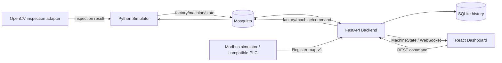

# MiniFactoryTwin

[English](README.md) | [한국어](README.ko.md)

> 산업 자동화, PLC 통신, 머신 비전 실험을 위한 오픈 소스 스마트 팩토리 디지털 트윈 시뮬레이터입니다.

**라이브 데모: [https://factory.elcherlab.com](https://factory.elcherlab.com)**

MiniFactoryTwin은 MQTT 또는 Modbus TCP를 상태 소스로 선택할 수 있는 생산 셀 디지털 트윈입니다. FastAPI가 두 소스를 공통 `MachineState`로 정규화하고, 생산 이력을 SQLite에 저장하며, WebSocket을 통해 React HMI에 실시간 상태를 전달합니다.

## 주요 기능

- 제품 이동 애니메이션이 포함된 실시간 컨베이어 시뮬레이션
- 설정 가능한 위치의 광전 센서
- GOOD/REJECT 분류와 공압 리젝트 실린더
- 생산량, 양품, 불량, 수율, 최근 1분 PPM 지표
- START, STOP, RESET, EMERGENCY STOP, E-stop 해제 명령
- Mosquitto 기반 MQTT 통신
- FastAPI 백엔드와 WebSocket 실시간 대시보드
- 백엔드 경계에서 검증하는 타입 기반 `MachineState` 계약
- 네트워크가 끊겨도 사용할 수 있고 자동으로 재연결되는 프런트엔드
- MQTT/Modbus TCP 소스 선택, 재연결 및 stale 데이터 처리
- 영구 SQLite 생산·알람·이벤트 이력
- 사이클 타임 분석과 생산 차트
- 선택형 OpenCV 이미지 검사와 fail-safe 판정
- Docker Compose 및 로컬 개발 환경

## 아키텍처



대시보드는 `MachineState` 스키마만 사용하며 시뮬레이터 코드나 MQTT 개념에 의존하지 않습니다. MQTT와 Modbus 어댑터는 React 컴포넌트를 변경하지 않고 동일한 백엔드 처리기로 상태를 전달합니다. 이미지 검사 역시 교체 가능한 어댑터로 분리되어 있습니다.

### MQTT 토픽

| 방향 | 토픽 | 페이로드 예시 |
| --- | --- | --- |
| 시뮬레이터 → 백엔드 | `factory/machine/state` | 전체 `MachineState` JSON |
| 백엔드 → 시뮬레이터 | `factory/machine/command` | `{"command":"start"}` |
| 시뮬레이터 → 백엔드 | `factory/machine/event` | 타입이 정의된 상태 전환 이벤트 JSON |

### MachineState 예시

```json
{
  "timestamp": "2026-01-01T00:00:00+00:00",
  "machine": { "power": true, "running": true, "emergency": false },
  "conveyor": { "running": true, "speed": 0.75 },
  "sensors": { "photo_1": false, "photo_2": false },
  "cylinder": { "state": "retracted" },
  "production": { "total": 128, "good": 125, "reject": 3, "ppm": 32 },
  "products": [{ "id": 101, "position": 42.5, "result": "GOOD" }]
}
```

## 빠른 시작

### 방법 A — 운영 중인 데모(권장)

[https://factory.elcherlab.com](https://factory.elcherlab.com)에 접속해 **Start**를 누릅니다. 별도 설치는 필요하지 않습니다.

### 방법 B — Docker Compose

요구 사항: Docker Engine 20.10 이상과 Compose 플러그인

```bash
git clone https://github.com/CyCle03/miniFactoryTwin.git
cd miniFactoryTwin
docker compose up --build
```

[http://localhost:8080](http://localhost:8080)을 열고 **Start**를 누릅니다. API 문서는 [http://localhost:8000/docs](http://localhost:8000/docs)에서 확인할 수 있습니다.

종료 명령:

```bash
docker compose down
```

### 방법 C — 로컬 개발

Python 3.11 이상과 Node.js 20 이상을 권장합니다. 네 개 프로세스를 별도 터미널에서 실행합니다.

1. Mosquitto 실행:

   ```bash
   docker compose up mosquitto
   ```

2. 저장소 루트에서 시뮬레이터 실행:

   ```bash
   python -m venv .venv
   # Windows: .venv\Scripts\activate
   # Linux/macOS: source .venv/bin/activate
   pip install -r simulator/requirements.txt
   python -m simulator.main
   ```

3. 다른 터미널에서 백엔드 실행:

   ```bash
   # 먼저 같은 가상환경을 활성화합니다.
   pip install -r backend/requirements.txt
   uvicorn backend.app.main:app --reload --port 8000
   ```

4. 프런트엔드 실행:

   ```bash
   cd frontend
   corepack enable
   pnpm install
   pnpm run dev
   ```

   [http://localhost:5173](http://localhost:5173)을 엽니다.

### 방법 D — Docker와 MQTT 없는 빠른 데모

개발 전용 로컬 전송 모드를 사용하면 Mosquitto 없이 대화형 대시보드를 실행할 수 있습니다. 동일한 Python 장비 시뮬레이터를 사용하되 MQTT 구간만 우회하며, 운영 Compose 경로에는 영향을 주지 않습니다.

```bash
# 터미널 1, 저장소 루트
python -m venv .venv
# Windows: .venv\Scripts\activate
# Linux/macOS: source .venv/bin/activate
pip install -r backend/requirements.txt -r simulator/requirements.txt

# Windows PowerShell
$env:LOCAL_SIMULATION = "true"
uvicorn backend.app.main:app --port 8000
```

```bash
# 터미널 2
cd frontend
corepack enable
pnpm install
pnpm run dev
```

[http://localhost:5173](http://localhost:5173)을 열고 **Start**를 누릅니다. 이 모드는 포트폴리오 데모나 로컬 UI 개발용입니다. MQTT 통합 경로는 Docker Compose로 검증하세요.

## 선택형 이미지 검사

기본값에서는 기존의 seeded GOOD/REJECT 동작을 유지합니다. Sensor 2에서 반복 가능한 샘플 이미지로 제품을 판정하려면 지원되는 이미지를 `inspection-images/`에 넣고 다음과 같이 실행합니다.

```bash
VISION_MODE=images docker compose up --build
```

이미지는 파일명 순서로 처리되며 제품 ID에 따라 순환 재사용됩니다. 현재 개발용 밝기 판정 어댑터는 CPU만 사용하고 결정론적으로 동작하며, 이후 YOLO 어댑터와 같은 인터페이스를 사용합니다. 읽을 수 없는 이미지, 처리 오류, `VISION_MIN_CONFIDENCE` 미만 결과는 안전하게 `REJECT` 처리됩니다. confidence, latency, model, defect 정보는 검사 이벤트와 생산 이력에 저장됩니다. 신뢰할 수 없는 카메라 피드는 마운트하지 마세요.

검사 원본이 있으면 최신 검사 패널에 제한된 크기로 미리보기가 표시됩니다. 백엔드는 읽기 전용 이미지 마운트 안에 있는 `.jpg`, `.jpeg`, `.png`, `.webp`, `.bmp` 파일만 제공합니다.

YOLO 추론을 사용하려면 Ultralytics 호환 모델을 `models/best.pt`에 두고 선택형 Compose override를 사용합니다. 용량이 큰 YOLO 의존성은 기본 시뮬레이터 이미지에 포함되지 않습니다.

```bash
docker compose -f docker-compose.yml -f docker-compose.vision.yml up --build
```

`VISION_GOOD_CLASSES`에는 GOOD으로 인정할 모델 클래스 이름을 쉼표로 구분해 설정합니다. 그 외 클래스, 감지 결과 없음, 추론 오류, 낮은 신뢰도 결과는 모두 fail-safe `REJECT` 경로를 따릅니다. 운영 또는 상업적 사용 전에는 Ultralytics 라이선스 조건을 확인하세요.

추론은 전용 worker에서 실행되므로 장비 상태 전송을 막지 않습니다. 제품은 판정 지점에서 최대 `VISION_TIMEOUT`초 동안 결과를 기다리며, 늦게 도착한 결과는 폐기하고 fail-safe `REJECT` 경로로 이동합니다.

## 운영 배포

운영 Compose는 호스트 loopback에 프런트엔드만 노출합니다. MQTT, FastAPI, Modbus TCP는 Docker 내부 네트워크에 유지되고 Caddy가 애플리케이션 앞에서 HTTPS를 종료합니다.

```bash
docker compose -f docker-compose.prod.yml up -d --build
```

[`ops/Caddyfile.factory`](ops/Caddyfile.factory)는 애플리케이션 전용 CSP와 함께 `factory.elcherlab.com`을 `127.0.0.1:3800`으로 라우팅합니다. 환경 설정은 [.env.example](.env.example)을 참고하세요. 네트워크 경계와 보안 헤더는 [보안 및 네트워크 노출 문서](docs/SECURITY.md)에 설명되어 있습니다.

## 조작과 동작

- **Start**: 셀 전원을 켜고 컨베이어를 시작합니다.
- **Stop**: 생산 데이터를 지우지 않고 이동과 제품 생성을 정지합니다.
- **Reset**: 컨베이어를 멈추고 제품과 카운터를 초기화합니다.
- **Emergency**: 모든 동작을 즉시 멈추고 재시작을 차단합니다.
- **Reset E-stop**: 안전 상태를 해제합니다. 이후 작업자가 다시 Start를 눌러야 합니다.
- 기본 모드에서는 제품 생성 시 95% 확률로 GOOD 판정합니다. 비전 모드에서는 Sensor 2의 이미지 검사 결과가 이를 대체합니다.
- REJECT 제품은 CY-01에서 제거되고 GOOD 제품은 배출구로 이동합니다.

## 검증

```bash
# 프런트엔드
cd frontend
pnpm run lint
pnpm run build

# Python 테스트 및 구문 검사(저장소 루트)
python3 -m venv .venv
.venv/bin/python -m pip install -r backend/requirements.txt -r simulator/requirements-dev.txt
.venv/bin/python -m compileall -q backend simulator modbus_simulator
.venv/bin/python -m pytest -q backend/tests simulator/tests

# Compose 구성
docker compose config --quiet
docker compose -f docker-compose.prod.yml config --quiet
```

## 프로젝트 구조

```text
MiniFactoryTwin/
├── frontend/            React + TypeScript HMI 대시보드
├── backend/app/         FastAPI, 모델, 소스 어댑터, 이력 저장소
├── simulator/           컨베이어 셀 로직, MQTT 서비스, 비전 어댑터
├── modbus_simulator/    Modbus TCP 장치 시뮬레이터
├── inspection-images/   선택형 반복 재생 검사 이미지
├── docker/              Mosquitto 개발 설정
├── docker-compose.yml   전체 로컬 스택
└── .github/workflows/   빌드 및 테스트 검사
```

## 로드맵

v0.4가 완료되었습니다. 이미지 또는 YOLO 모드에서는 비전 검사 이력과 함께
원본 검사 이미지가 제한된 크기의 미리보기로 표시됩니다.

버전별 범위, 제외 대상, 승인 기준은 [개발 로드맵](docs/ROADMAP.md)을 참고하세요.

- **v0.1 완료** — MQTT 기반 동작 가능한 디지털 트윈
- **v0.2 완료** — SQLite 생산 이력, 이벤트, 사이클 타임, 차트
- **v0.3 완료** — Modbus TCP 시뮬레이터, 레지스터 맵, 교체 가능한 PLC 어댑터
- **v0.4 완료** — OpenCV/YOLO 검사, 비동기 fail-safe 처리, 검사 이력과 이미지 미리보기
- **v0.5 예정** — 구성 가능한 컴포넌트와 SIMULATED/REAL 모드
- **v0.6 예정** — 다중 생산 셀과 팩토리 레이아웃
- **향후** — ROS2, AMR, TurtleBot 디지털 트윈

### 데이터 백업

Docker 볼륨을 삭제하지 않고 SQLite 이력을 백업합니다.

```bash
docker compose -f docker-compose.prod.yml exec backend python -c "import sqlite3; src=sqlite3.connect('/data/minifactory.db'); dst=sqlite3.connect('/data/minifactory-backup.db'); src.backup(dst); dst.close(); src.close()"
```

복원은 백엔드를 중지하고 현재 데이터베이스를 별도로 보존한 다음 수행하세요. RESET 명령은 실시간 카운터와 제품만 초기화하며 이력을 삭제하지 않습니다.

## v0.3 Modbus 모드

동일한 API, WebSocket 계약, 대시보드, 이력, 제어 기능이 MQTT와 Modbus TCP 어댑터 모두에서 동작합니다. MQTT가 안전한 기본값입니다.

- 기존 시뮬레이터: `DATA_SOURCE=mqtt`
- Modbus TCP 시뮬레이터 또는 호환 PLC: `DATA_SOURCE=modbus`
- `/api/source`에서 활성 소스, 연결 상태, stale 상태, 오류를 확인할 수 있습니다.
- Modbus 포트는 Compose 네트워크 내부에만 있으며 호스트에 공개되지 않습니다.

코일, 레지스터, 배율, 명령 응답 및 실제 PLC 교체 조건은 [Modbus 레지스터 맵 v1](docs/MODBUS_REGISTER_MAP.md)을 참고하세요.

```bash
DATA_SOURCE=modbus docker compose -f docker-compose.prod.yml up -d --build
```

소스 변경 시 백엔드 컨테이너를 다시 생성해야 합니다. 장비 가동 중 자동 소스 전환은 안전을 위해 구현하지 않았습니다.

## 보안 문서

운영 보안 헤더, Docker 네트워크 경계, 검증 명령과 보류 중인 CSP 강화 작업은 [보안 및 네트워크 노출](docs/SECURITY.md)을 참고하세요. Mosquitto 익명 접근은 격리된 개발 네트워크에서만 사용해야 합니다.

## 프로젝트 목적

산업 시스템은 PLC 프로그램이나 대시보드 하나로 끝나지 않습니다. 결정론적 장비 동작, 필드 프로토콜, 백엔드 검증, 실시간 데이터 전달, 운영자용 시각화를 연결해야 합니다. MiniFactoryTwin은 각 계층을 독립적으로 교체하고 이해할 수 있도록 유지하면서 **산업 자동화 + 백엔드 + 프런트엔드 + IoT + 컴퓨터 비전**을 함께 다루는 실용적인 통합 프로젝트입니다.

## 라이선스

[MIT](LICENSE)
