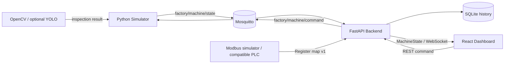

# MiniFactoryTwin

[English](README.md) | [한국어](README.ko.md)

> An open-source smart factory digital twin simulator for industrial automation, PLC communication and machine vision experiments.

**Live demo: [https://factory.elcherlab.com](https://factory.elcherlab.com)**

MiniFactoryTwin is a production-cell digital twin with selectable MQTT and Modbus TCP state sources. FastAPI normalizes either source into a shared MachineState, persists production history in SQLite, and streams live state to the React HMI over WebSocket.

## Features

- Real-time conveyor simulation with animated product movement
- Photoelectric sensors at configurable positions
- Pneumatic reject cylinder with GOOD / REJECT routing
- Production, good, reject, yield, and rolling PPM counters
- START, STOP, RESET, EMERGENCY STOP, and E-stop reset commands
- MQTT communication through Mosquitto
- FastAPI backend and WebSocket real-time dashboard
- Typed `MachineState` contract validated at the backend boundary
- Reconnecting frontend that remains usable during network loss
- Selectable MQTT or Modbus TCP source with reconnect and stale-data handling
- Docker Compose and local development workflows
- Persistent SQLite production and alarm/event history
- Cycle-time analytics and lightweight production charts

## Architecture



The dashboard knows only the `MachineState` schema. It does not import simulator code or MQTT concepts. MQTT and Modbus adapters feed the same backend handler without changing the React components, and machine-vision inference is isolated behind a replaceable inspection adapter.

### MQTT topics

| Direction | Topic | Payload example |
| --- | --- | --- |
| Simulator → backend | `factory/machine/state` | Full `MachineState` JSON |
| Backend → simulator | `factory/machine/command` | `{"command":"start"}` |
| Simulator → backend | `factory/machine/event` | Typed transition event JSON |

### MachineState

```json
{
  "timestamp": "2026-01-01T00:00:00+00:00",
  "machine": { "power": true, "running": true, "emergency": false },
  "conveyor": { "running": true, "speed": 0.75 },
  "sensors": { "photo_1": false, "photo_2": false },
  "cylinder": { "state": "retracted" },
  "production": { "total": 128, "good": 125, "reject": 3, "ppm": 32 },
  "products": [{ "id": 101, "position": 42.5, "result": "GOOD" }]
}
```

## Quick Start

### Option A — Hosted demo (recommended)

Open [https://factory.elcherlab.com](https://factory.elcherlab.com) and press
**Start**. No installation is required.

### Option B — Docker Compose

Requirements: Docker Engine 20.10+ with the Compose plugin.

```bash
git clone https://github.com/CyCle03/miniFactoryTwin.git
cd miniFactoryTwin
docker compose up --build
```

Open [http://localhost:8080](http://localhost:8080), then press **Start**. The API documentation is available at [http://localhost:8000/docs](http://localhost:8000/docs).

Stop the stack with:

```bash
docker compose down
```

### Option C — Local development

Run the four processes in separate terminals. Python 3.11+ and Node.js 20+ are recommended.

1. Start Mosquitto:

   ```bash
   docker compose up mosquitto
   ```

2. Start the simulator from the repository root:

   ```bash
   python -m venv .venv
   # Windows: .venv\Scripts\activate
   # Linux/macOS: source .venv/bin/activate
   pip install -r simulator/requirements.txt
   python -m simulator.main
   ```

3. Start the backend in another terminal:

   ```bash
   # Activate the same virtual environment first
   pip install -r backend/requirements.txt
   uvicorn backend.app.main:app --reload --port 8000
   ```

4. Start the frontend:

   ```bash
   cd frontend
   corepack enable
   pnpm install
   pnpm run dev
   ```

   Open [http://localhost:5173](http://localhost:5173).

### Option D — No Docker / no MQTT quick demo

For a complete interactive dashboard demo without Docker Desktop or Mosquitto,
run the backend's development-only local transport. It reuses the same Python
machine simulator but bypasses the MQTT hop; the production Compose path is
unchanged.

```bash
# Terminal 1, from the repository root
python -m venv .venv
# Windows: .venv\Scripts\activate
# Linux/macOS: source .venv/bin/activate
pip install -r backend/requirements.txt -r simulator/requirements.txt

# Windows PowerShell
$env:LOCAL_SIMULATION = "true"
uvicorn backend.app.main:app --port 8000
```

```bash
# Terminal 2
cd frontend
corepack enable
pnpm install
pnpm run dev
```

Open [http://localhost:5173](http://localhost:5173), then press **Start**.
Use this mode for local UI development only; use Docker Compose to test the
MQTT integration path.

### Optional image inspection

The simulator keeps its original seeded GOOD/REJECT behavior by default. To
classify products from repeatable sample images at Sensor 2, place supported
images in `inspection-images/` and start the stack with image inspection enabled:

```bash
VISION_MODE=images docker compose up --build
```

Images are processed in filename order and reused cyclically by product ID.
The development brightness adapter provides deterministic, CPU-only behavior
behind the same interface intended for a later YOLO adapter. Unreadable images,
processing errors, and results below `VISION_MIN_CONFIDENCE` fail safe to
`REJECT`. Confidence, latency, model, and defect metadata are recorded with the
inspection event and production history. Do not mount untrusted camera feeds.
When an inspection source image is available, the latest-inspection panel shows
a bounded preview served by the backend from its read-only image mount. Only
`.jpg`, `.jpeg`, `.png`, `.webp`, and `.bmp` files in that directory are exposed.

For YOLO inference, place an Ultralytics-compatible model at `models/best.pt`
and use the optional Compose override. The larger YOLO dependencies are kept
out of the default simulator image:

```bash
docker compose -f docker-compose.yml -f docker-compose.vision.yml up --build
```

Set `VISION_GOOD_CLASSES` to a comma-separated list of model classes that are
accepted as GOOD. Every other class, missing detection, inference error, or
low-confidence result follows the fail-safe REJECT path. Review the Ultralytics
license terms before production or commercial use.

Inference runs on a dedicated worker so machine-state publication remains
responsive. A product waits at the decision point for up to `VISION_TIMEOUT`
seconds; a late result is discarded and the product follows the fail-safe
REJECT route.

### Production deployment

The production Compose file exposes only the frontend on the host loopback
interface. MQTT and FastAPI remain private inside the Docker network and Caddy
terminates HTTPS in front of the application. Mosquitto, FastAPI, and Modbus
TCP remain private to the Docker network.

```bash
docker compose -f docker-compose.prod.yml up -d --build
```

The included [`ops/Caddyfile.factory`](ops/Caddyfile.factory) routes
`factory.elcherlab.com` to `127.0.0.1:3800` with an application-specific CSP.

Configuration can be overridden with the environment variables documented in [.env.example](.env.example). See [Security and Network Exposure](docs/SECURITY.md) for security headers, private ports, and verification. Mosquitto anonymous access is for isolated development networks only.

## Controls and behavior

- **Start** powers the simulated cell and starts the conveyor.
- **Stop** halts motion and product generation without clearing production data.
- **Reset** stops the conveyor and clears workpieces and counters.
- **Emergency** immediately stops all motion and prevents restart.
- **Reset E-stop** clears the safety state; the operator must press Start again.
- Products are classified at creation (95% GOOD by default). REJECT products are removed at CY-01, while GOOD products leave through the outfeed.

## Validation

```bash
# Frontend
cd frontend
pnpm run lint
pnpm run build

# Python environment and tests (from repository root)
python3 -m venv .venv
.venv/bin/python -m pip install -r backend/requirements.txt -r simulator/requirements-dev.txt
.venv/bin/python -m compileall -q backend simulator modbus_simulator
.venv/bin/python -m pytest -q backend/tests simulator/tests

# Compose configuration
docker compose config --quiet
```

## Project structure

```text
MiniFactoryTwin/
├── frontend/            React + TypeScript HMI dashboard
├── backend/app/         FastAPI, Pydantic models, MQTT bridge, WebSocket manager
├── simulator/           Deterministic conveyor-cell logic and MQTT service
├── docker/              Mosquitto development configuration
├── docker-compose.yml   Full local stack
└── .github/workflows/   Build and test checks
```

## Roadmap

Version 0.4 is complete: vision-backed history now includes a bounded preview
of the source inspection image when image or YOLO mode is enabled.

See [Development Roadmap](docs/ROADMAP.md) for detailed scope, dependencies,
out-of-scope decisions, and acceptance criteria for every planned version.

### v0.2 (complete)

- SQLite production history in the `production-data` Docker volume (`/data/minifactory.db`)
- Typed MQTT alarm and event history on `factory/machine/event`
- Cycle-time calculation and hourly production charts
- Read-only APIs: `/api/history/production`, `/api/history/events`, `/api/analytics/summary`, and `/api/analytics/production`

Back up without deleting the volume:

```bash
docker compose -f docker-compose.prod.yml exec backend python -c "import sqlite3; src=sqlite3.connect('/data/minifactory.db'); dst=sqlite3.connect('/data/minifactory-backup.db'); src.backup(dst); dst.close(); src.close()"
```

Restore only while the backend is stopped, after preserving the current database. RESET clears live counters and workpieces but never history.

### v0.3 (complete)

- Modbus TCP simulator and versioned register map
- Replaceable PLC source adapter
- Command acknowledgement, reconnect, and stale/offline status

### v0.4 (complete)

- Deterministic OpenCV sample-image inspection and optional YOLO adapter
- Asynchronous inference with timeout and fail-safe REJECT routing
- Inspection confidence, latency, model, defect, and source-image history
- Safely bounded source-image preview in the HMI

### v0.5

- Component configuration
- Sensor/register mapping
- SIMULATED / REAL device modes

### v0.6

- Multiple production cells
- Factory layout view

### Future

- ROS2 integration
- Mobile robot / TurtleBot digital twin
- AMR location visualization

## Why this project?

Industrial systems are rarely just PLC programs or just dashboards. They connect deterministic equipment behavior, field protocols, backend validation, live data delivery, and operator-facing visualization. MiniFactoryTwin is designed as a practical integration project across **Industrial Automation + Backend + Frontend + IoT + Computer Vision**, while keeping each layer independently replaceable and understandable.

## v0.3 Modbus mode

The same API, WebSocket contract, dashboard, history, and controls operate with
either MQTT state or the Modbus TCP adapter. MQTT remains the safe default.

- Use DATA_SOURCE=mqtt for the original simulator.
- Use DATA_SOURCE=modbus for the Modbus TCP simulator or compatible PLC.
- Configure MODBUS_HOST, MODBUS_PORT, MODBUS_UNIT_ID, MODBUS_POLL_INTERVAL,
  MODBUS_STALE_TIMEOUT, and MODBUS_COMMAND_TIMEOUT as needed.
- GET /api/source reports the active source, connection, stale state, and error.
- The Modbus port is private to the Compose network and is not host-published.

See [Modbus register map v1](docs/MODBUS_REGISTER_MAP.md) for coils, registers,
scaling, command acknowledgement, and real-PLC replacement requirements.

Run a Modbus-mode deployment with:

    DATA_SOURCE=modbus docker compose -f docker-compose.prod.yml up -d --build

Switching sources is explicit and requires a backend recreation. Automatic
control-source switching while running is intentionally not implemented.


## Security documentation

See [Security and Network Exposure](docs/SECURITY.md) for production security
headers, the Docker network boundary, and verification commands.

## License

[MIT](LICENSE)
