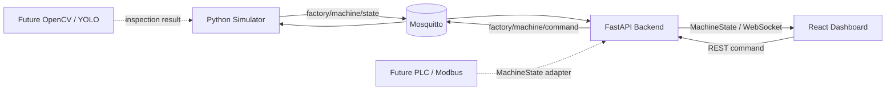

# MiniFactoryTwin

> An open-source smart factory digital twin simulator for industrial automation, PLC communication and machine vision experiments.

MiniFactoryTwin is a small but working conveyor-cell digital twin. A Python machine simulator publishes a source-neutral `MachineState` over MQTT, FastAPI validates and forwards it over WebSocket, and a React dashboard renders the equipment state. The first release focuses on a believable control loop and a clean boundary between equipment data and UI code.

## Features

- Real-time conveyor simulation with animated product movement
- Photoelectric sensors at configurable positions
- Pneumatic reject cylinder with GOOD / REJECT routing
- Production, good, reject, yield, and rolling PPM counters
- START, STOP, RESET, EMERGENCY STOP, and E-stop reset commands
- MQTT communication through Mosquitto
- FastAPI backend and WebSocket real-time dashboard
- Typed `MachineState` contract validated at the backend boundary
- Reconnecting frontend that remains usable during network loss
- Modbus-ready and machine-vision-ready data-source separation
- Docker Compose and local development workflows

## Architecture



The dashboard knows only the `MachineState` schema. It does not import simulator code or MQTT concepts. A future Modbus/PLC adapter can therefore feed the same backend handler without changing the React components. ROS2 and TurtleBot are intentionally **not implemented** in v0.1.

### MQTT topics

| Direction | Topic | Payload example |
| --- | --- | --- |
| Simulator → backend | `factory/machine/state` | Full `MachineState` JSON |
| Backend → simulator | `factory/machine/command` | `{"command":"start"}` |

### MachineState

```json
{
  "timestamp": "2026-01-01T00:00:00+00:00",
  "machine": { "power": true, "running": true, "emergency": false },
  "conveyor": { "running": true, "speed": 0.75 },
  "sensors": { "photo_1": false, "photo_2": false },
  "cylinder": { "state": "retracted" },
  "production": { "total": 128, "good": 125, "reject": 3, "ppm": 32 },
  "products": [{ "id": 101, "position": 42.5, "result": "GOOD" }]
}
```

## Screenshots

Add a dashboard screenshot or short GIF here after deploying the project:

<!-- docs/screenshots/dashboard.png -->

## Quick Start

### Option A — Docker Compose (recommended)

Requirements: Docker Engine 20.10+ with the Compose plugin.

```bash
git clone <your-repository-url>
cd MiniFactoryTwin
docker compose up --build
```

Open [http://localhost:8080](http://localhost:8080), then press **Start**. The API documentation is available at [http://localhost:8000/docs](http://localhost:8000/docs).

Stop the stack with:

```bash
docker compose down
```

### Option B — Local development

Run the four processes in separate terminals. Python 3.11+ and Node.js 20+ are recommended.

1. Start Mosquitto:

   ```bash
   docker compose up mosquitto
   ```

2. Start the simulator from the repository root:

   ```bash
   python -m venv .venv
   # Windows: .venv\Scripts\activate
   # Linux/macOS: source .venv/bin/activate
   pip install -r simulator/requirements.txt
   python -m simulator.main
   ```

3. Start the backend in another terminal:

   ```bash
   # Activate the same virtual environment first
   pip install -r backend/requirements.txt
   uvicorn backend.app.main:app --reload --port 8000
   ```

4. Start the frontend:

   ```bash
   cd frontend
   corepack enable
   pnpm install
   pnpm run dev
   ```

   Open [http://localhost:5173](http://localhost:5173).

### Option C — No Docker / no MQTT quick demo

For a complete interactive dashboard demo without Docker Desktop or Mosquitto,
run the backend's development-only local transport. It reuses the same Python
machine simulator but bypasses the MQTT hop; the production Compose path is
unchanged.

```bash
# Terminal 1, from the repository root
python -m venv .venv
# Windows: .venv\Scripts\activate
# Linux/macOS: source .venv/bin/activate
pip install -r backend/requirements.txt -r simulator/requirements.txt

# Windows PowerShell
$env:LOCAL_SIMULATION = "true"
uvicorn backend.app.main:app --port 8000
```

```bash
# Terminal 2
cd frontend
corepack enable
pnpm install
pnpm run dev
```

Open [http://localhost:5173](http://localhost:5173), then press **Start**.
Use this mode for a portfolio demo or local UI development only; use Docker
Compose to test the MQTT integration path.

Configuration can be overridden with the environment variables documented in [`.env.example`](.env.example). Mosquitto's anonymous listener is intended for **local development only**; production deployments should add authentication and TLS.

## Controls and behavior

- **Start** powers the simulated cell and starts the conveyor.
- **Stop** halts motion and product generation without clearing production data.
- **Reset** stops the conveyor and clears workpieces and counters.
- **Emergency** immediately stops all motion and prevents restart.
- **Reset E-stop** clears the safety state; the operator must press Start again.
- Products are classified at creation (95% GOOD by default). REJECT products are removed at CY-01, while GOOD products leave through the outfeed.

## Validation

```bash
# Frontend
cd frontend
pnpm run lint
pnpm run build

# Simulator unit tests (from repository root)
pip install -r simulator/requirements-dev.txt
pytest simulator/tests

# Python syntax/import check
python -m compileall -q backend simulator

# Compose configuration
docker compose config --quiet
```

## Project structure

```text
MiniFactoryTwin/
├── frontend/            React + TypeScript HMI dashboard
├── backend/app/         FastAPI, Pydantic models, MQTT bridge, WebSocket manager
├── simulator/           Deterministic conveyor-cell logic and MQTT service
├── docker/              Mosquitto development configuration
├── docker-compose.yml   Full local stack
└── .github/workflows/   Build and test checks
```

## Roadmap

### v0.2

- SQLite production history
- Alarm and event history
- Cycle-time calculation
- Production charts

### v0.3

- Modbus TCP simulator and register map
- Real PLC connection adapter

### v0.4

- OpenCV camera integration
- YOLO-based inspection
- Replace randomized GOOD / REJECT results with vision inference

### v0.5

- Component configuration
- Sensor/register mapping
- SIMULATED / REAL device modes

### v0.6

- Multiple production cells
- Factory layout view

### Future

- ROS2 integration
- Mobile robot / TurtleBot digital twin
- AMR location visualization

## Why this project?

Industrial systems are rarely just PLC programs or just dashboards. They connect deterministic equipment behavior, field protocols, backend validation, live data delivery, and operator-facing visualization. MiniFactoryTwin is designed as a practical integration project across **Industrial Automation + Backend + Frontend + IoT + Computer Vision**, while keeping each layer independently replaceable and understandable.

## License

[MIT](LICENSE)
